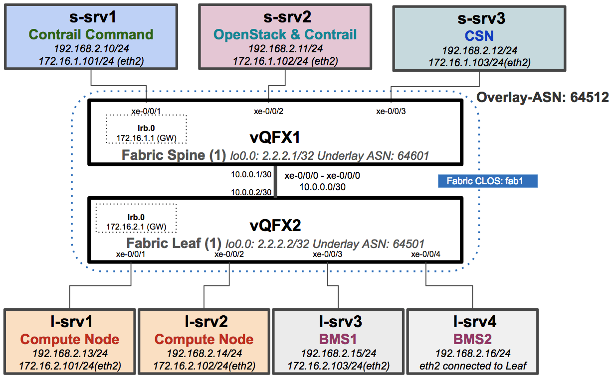
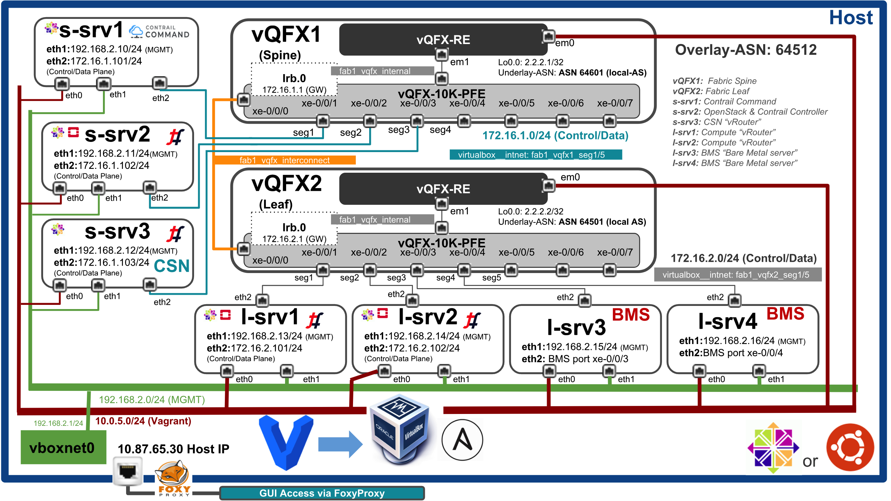

# Contrail Fabric Manager Vagrant Setup

This repo is created for quick CFM poc/demo setup using Vagrant on a single Host "BMS" Bare Matel Server. If you are interested in setting up basic 1x1 Spine & leaf Fabric with couple of nodes for CFM use-cases demo/poc this repo will guide you in setting up topology and provide setp by step instructions for topology creation, installation of SW and E2E testing different use cases.

***High Level Topology Diagram***
 (1x1 vQFX Spine & Leaf with 7 Nodes)



***Detail Topology Diagram***

Frist step is prepartion of host machine and the host can be running an Ubuntu or CentOS OS, please follow "Host Server Vagrant Setup" section for detail instructions.

## Host Server Vagrant Setup (prerequisite)

1. Install Ubuntu 16.04.3 or CentOS 7.5 OS on the BMS and install following software using scripts provided under folder "scripts".

    * Vagrant 2.1.1
    * Python 2.7.5
    * VirtualBox 5.2
    * Ansible 2.5.3

```bash
cd /root
git clone https://github.com/qarham/cfm-vagrant.git
cd cfm-vagrant/scripts
chmod +x setup_*

## Run script as per your OS for SW installation
./setup_vagrant_centos.sh
or
./setup_vagrant_ubuntu.sh

## Now verify the SW installation using following command
vboxmanage --version
  5.2.12r122591

vagrant --version
  Vagrant 2.1.1

ansible --version
   ansible 2.5.3

pip list | grep junos
&
pip list | grep jxmlease

ansible-galaxy list
  - Juniper.junos, 2.1.0

 ```

2. Now after sucessful installtion of SW let's download and add all Vagrant boxes requried for the setup.

Note: This step will speed up creation of whole setup topology.

```bash
cd /var/tmp
# Download vqfx re and pfe boxes from following link
wget http://10.84.5.120/cs-shared/images/vagrant-boxes/vqfx-re-virtualbox.box
wget http://10.84.5.120/cs-shared/images/vagrant-boxes/vqfx10k-pfe-virtualbox.box 

# Add vagrant boxes using following command
vagrant box add --name juniper/vqfx10k-re /var/tmp/vqfx-re-virtualbox.box
vagrant box add --name juniper/vqfx10k-pfe /var/tmp/vqfx10k-pfe-virtualbox.box

# Download CentOS 350GB Box from Vagrant Cloud, specially created for Contrail disk size requirmenet
vagrant box add qarham/CentOS7.5-350GB

# Check all the boxes added successfully and available 
vagrant box list
    juniper/vqfx10k-pfe    (virtualbox, 0)
    juniper/vqfx10k-re     (virtualbox, 0)
    qarham/CentOS7.5-350GB (virtualbox, 1.0)
 ```

## 1x1 vQFX and 7 nodes Setup (Bringing Up)

After sucessful installtion of prerequisite SW and adding vagrant boxes now it's time bringing up the whole topology up and running. Please follow below steps:

```bash
cd /root/cfm-vagrant/cfm-2qfx-8srv/

# check status of all nodes and make sure no errors
vagrant status

# Bring the whole topology up
vagrant up

# Note above command will take approx 20-30 min to bring the whole setup up as per topology captured in high-level and detail diagramns

# Check all the nodes are up 
vagrant status

# Login to s-srv1 and test connectivity to leaf,spine and other node
vagrant ssh s-srv1

ping 2.2.2.1  (Connection to vQFX spine)
ping 2.2.2.2 (Connection to vQFX leaf)
ping 172.16.2.101-103 (Connection to nodes connected to vQFX leaf)

# Login to vQFX1 spine for setup validation
vagrant ssh vqfx1

show bgp summary
show route advertise-protocol bgp 10.0.0.2
show route receive-protocol bgp 10.0.0.2

ping 2.2.2.2
ping 172.16.1.101 & 102
ping 172.16.2.101 - 103
 ```

Now after brining setup up and basic validation it's time to start installing Contrail CFM SW and basic use-cases testing. All validated use-cases are documented under folder "docs" and use following link for step to setp installations and validation.

## Use-cases Tested on this setup

* ### [UC-01-Contrail_Command_Installtion](docs/01-Install-Contrail-Command.md)

* ### [UC-02-Contrail_Cloud_Cluster_Provisioning](docs/02-Contrail-Cloud-Cluster-Provisioning.md)

* ### [UC-03-Fabric_Creation_Discovery_Onboarding](docs/03-Fabric-Creation-Discovery-Config.md)

* ### [UC-04-Intra_VN_BMS_VM](docs/04-BMS-VM-Intra-VN.md)


## How to use FoxyProxy for GUI access

Follow these steps for GUI access via FoxyProxy.
1- Open FireFox and open https://addons.mozilla.org/en-US/firefox/ URL.
2- Search for FoxyProxy and select "FoxyProxy Standard"
3- Click on "Add to Firefox"


Note: I used FirFox FoxyProxy add-on


Now open ssh pot forwading session to Host 10.1.1.100 using port 1080. please change IP as per your host config

```bash
your-laptop> ssh root@10.87.65.30 -D 1080
```

Configure FireFox FoxyProxy add-on by configuring "127.0.0.1" & port 1080 as Scoks4 as captured in screenshot. 


Now enable FoxyProxy add-on by selecting the profile created earlier and open Contrail GUI using IP address of Vagrant VMs 192.168.2.11/12

***Contrail Command GUI*** https://192.168.2.10:9091

***Contrail OLD GUI*** https://192.168.2.11:8143

***OpenStack GUI*** http://192.168.2.11

### References

* <https://github.com/Juniper/contrail-ansible-deployer/wiki>
* <https://github.com/Juniper/vqfx10k-vagrant>