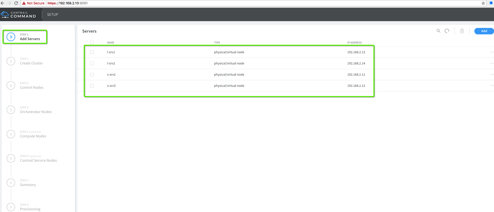
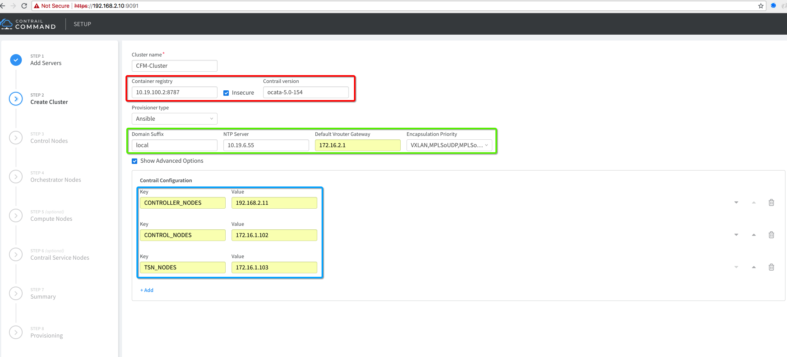
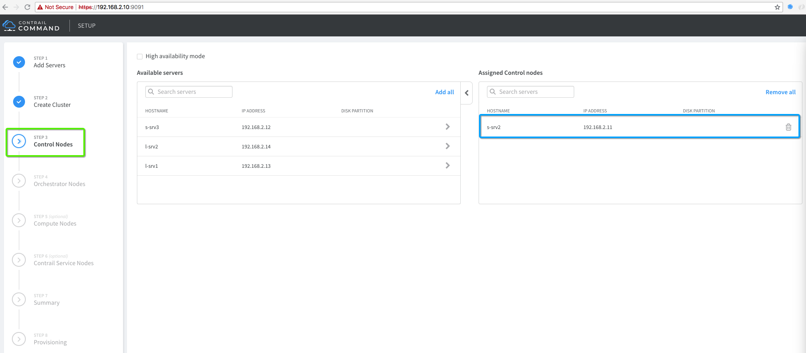
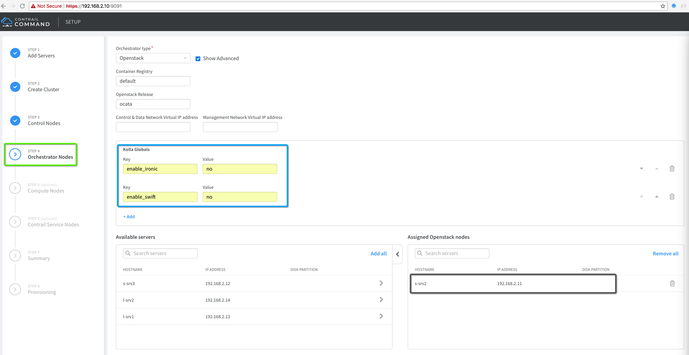
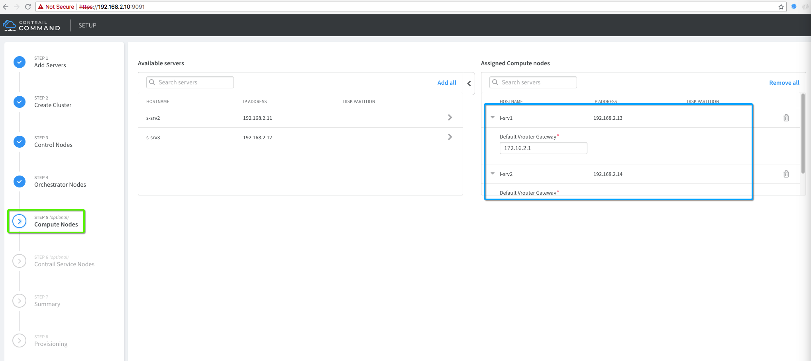
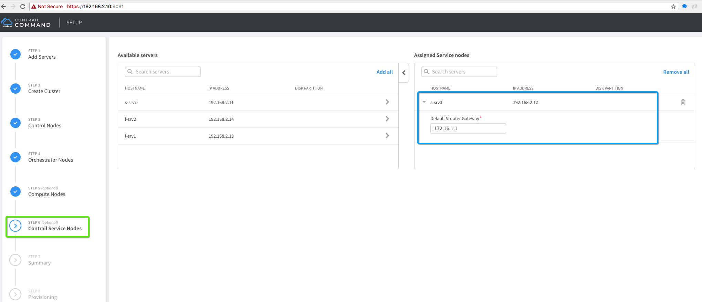
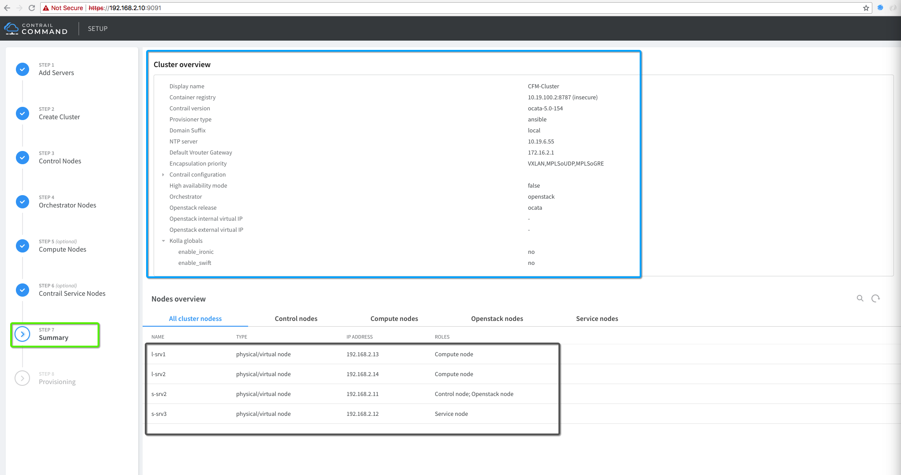
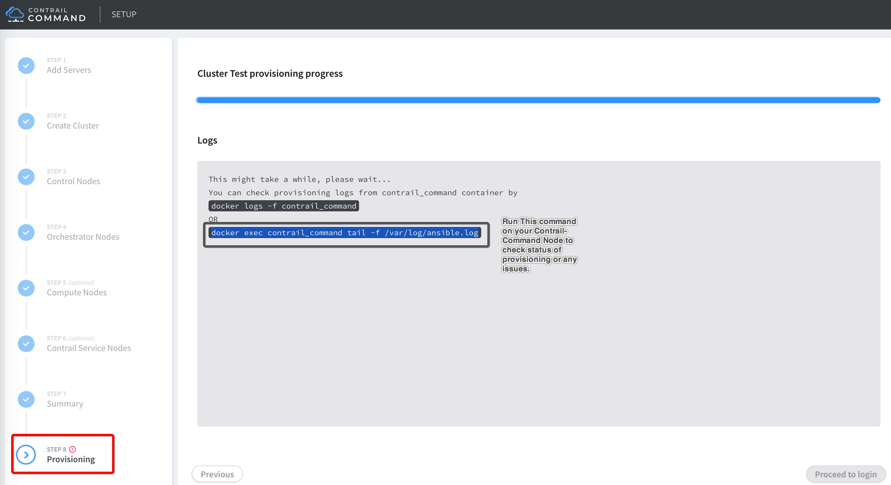

# Provisioning of Contrail Cloud Clsuter via Contrail Command UI

***URL for Contrail Command GUI Access***   https://<contrail_command_node_IP>:9091>

Username/Password:   admin/contrail123

## 1. Add Servers


## 2. Add All Servers



## 3. Create Cluster



## 4. Add Contrail Control Node



## 5. Add OpenStack Control Node (Orchestration)



## 6. Add Compute Node




## 7. Add Contrail Service Node (Old TSN)




## 8. Cluster Summary



## 9. Cluster Summary




## 10. Check instances.yml

Contrail Command GUI creates instances.yml file used for clsuter provisioning at following location "/var/tmp/contrail_cluster/<Cluster-UUID>/". Please check and review.

```bash
cat /var/tmp/contrail_cluster/a3d545fa-3fe9-4f5f-b35c-a605cb30c408/instances.yml
global_configuration:
  CONTAINER_REGISTRY: 10.84.5.81:5000
  REGISTRY_PRIVATE_INSECURE: True
provider_config:
  bms:
    ssh_user: root
    ssh_pwd: c0ntrail123
    ntpserver: 172.21.200.60
    domainsuffix: englab.juniper.net
instances:
  srv1:
    ip: 10.87.65.71
    provider: bms
    roles:
      config:
      config_database:
      control:
      webui:
      analytics:
      analytics_database:
      openstack_control:
      openstack_network:
      openstack_storage:
      openstack_monitoring:
  srv2:
    ip: 10.87.65.72
    provider: bms
    roles:
      vrouter:
        VROUTER_GATEWAY: 172.16.1.1
      openstack_compute:
  srv3:
    ip: 10.87.65.73
    provider: bms
    roles:
      vrouter:
        TSN_EVPN_MODE: true
        VROUTER_GATEWAY: 172.16.1.1
contrail_configuration:
  CONTRAIL_VERSION: ocata-5.0-115
  CLOUD_ORCHESTRATOR: openstack
  RABBITMQ_NODE_PORT: 5673
  VROUTER_GATEWAY: 172.16.1.1
  ENCAP_PRIORITY: VXLAN,MPLSoUDP,MPLSoGRE
  AUTH_MODE: keystone
  KEYSTONE_AUTH_HOST: 10.87.65.71
  KEYSTONE_AUTH_URL_VERSION: /v3
  CONTROLLER_NODES: 10.87.65.71
  CONTROL_NODES: 172.16.1.101
  TSN_NODES: 172.16.1.103
kolla_config:
  kolla_globals:
    openstack_release: ocata
    enable_haproxy: no
    enable_ironic: no
    enable_swif: no
  kolla_passwords:
    keystone_admin_password: contrail123

 ```

## 11. Compute Node QEMU (hypervisor/emulator) change if your Host does not support KVM HW virtualization (Nested mode)

Note: You usually need that for AWS setup which does not support HW virtualization. Your VM instance creation will fail and you have to make following changes in "nova-compute" before creating the workload.


```bash
vi /etc/kolla/nova-compute/nova.conf

# Add last two line under [libvirt] section 
[libvirt]
connection_uri = qemu+tcp://10.87.65.72/system
virt_type=qemu
cpu_mode=none

# After making changes restart "nova_compute" conatiner on the compute
docker restart nova_compute
```

## 12. Basic Sanity Check

To make sure Cluster provisioning is successful and no issue let's create some work load using a simple basic sanity script "basic-sanity-test.sh".

This script will perform following actions:
* install OpenStack client 
* Download and Add cirros images
* Create VM flavors
* Create TWO VNs VN01: 10.1.1.0/24 & VN02: 20.1.1.0/24
* Instantiate one VM in each VN (VN01 & VN02)

```bash
wget https://raw.githubusercontent.com/qarham/tf-os-k8s-vagrant/master/cfm-vagrant/scripts/basic-sanity-test.sh

chmod +x basic-sanity-test.sh

./basic-sanity-test.sh

 ```

## Other Tips

In case provisioning fail for Contrail install and you would like to run ansible provisioning manually you can use following command

```bash

ansible-playbook -i inventory/ -e orchestrator=openstack -e config_file=/var/tmp/contrail_cluster/<Cluseter-UUID>/instances.yml playbooks/install_contrail.yml
 ```

To reset OpenStack Kola use following command:

Login to contrail_command container and follow the steps:

```bash
docker exec -it contrail_command bash
cd /usr/share/contrail/contrail-kolla-ansible
./tools/kolla-ansible -i ansible/inventory/my_inventory --configdir etc/kolla --passwords etc/kolla/passwords.yml destroy --yes-i-really-really-mean-it
 ```


### References

* <https://github.com/Juniper/contrail-ansible-deployer/wiki>
* <https://github.com/Juniper/vqfx10k-vagrant>