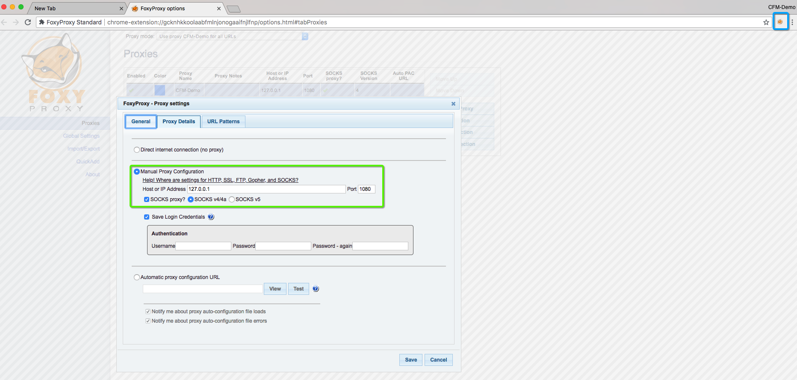

# How to setup FoxyProxy for a Chrome browser?

Here are the steps for setting up FoxyProxy in Chrome.

1. Create a new chrome profile for the workshop "CFM-Workshop"
   


2. Select "Chrome Web Store" and install FoxyProxy addon 
   


3. Click FoxyProxy Addon on top right and select options. After that Click on "Add New Proxy"


4. Configure new proxy profile with following parameters:
    1. Host or IP Address: 127.0.0.1
    2. Port: 1080
    3. Select "SOCKS proxy" & "SOCKS v4/v4a"
    4. Save
   


5. SSH to host with option "-D 1080"
   
```bash
# 1st step is open SSH session to the host node 
ssh root@<host-ip> -D 1080
 ```

6. Now enable FoxyProxy add-on by selecting the profile created in above step and open Contrail GUIs using IP addresses of Vagrant VMs 192.168.2.11/12

***Contrail Command GUI*** https://192.168.2.10:9091

***Contrail OLD GUI*** https://192.168.2.11:8143

***OpenStack GUI*** http://192.168.2.11

***Note***: Username/Password: admin/contrail123

## Contrail Command UI screenshot
